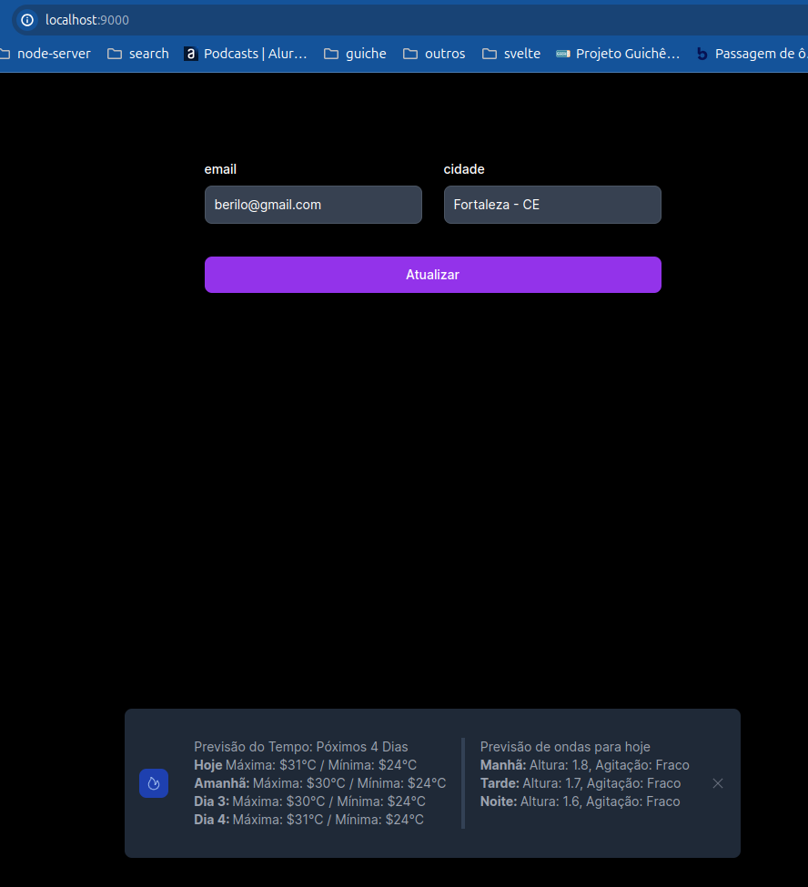

# Desafio backend

## Desenho da solução


## Introdução
A solução tem como objetivo enviar mensagens com informações de previsão do tempo 
para uma aplicação web. Sendo possível fazer o agendamento desse envio. O conteúdo da mensagem depende 
da localização do usuário. O usuário poderá também ser cadastrado, ativado e desativado. (ler arquivo Desafio.md na pasta docs)

A autenticação e autorização não está contemplada no projeto. Considerou-se que é feita por outro serviço, utilizando talvez a camada de infra e talvez um provider como keyloak e etc.  

## app_containers
É o conjunto de aplicativos internos da solução. Os blocos contidos são containers. Esses blocos chamaremos neste documento de módulos

## cache_sync_service
Atualiza cache de tempos em tempos com informações das localidades existentes no mgmt.
### casos de uso
- sync
  - job que roda de tempos em tempos. Este consulta as localidades diferentes no mgmt, e popula no cache. Considera-se rodar este job todos os dias.
- get_msg
  - possibilita captura da mensagem com base num valor de 'nome cidade - UF', Usado pelo core, este uso é feito utilizando injeção do usecase, poderia ter sido feito via http, mas não foi a decisão.

## core
Responsável pela gestão de usuários e agendamentos. De forma que de tempos em tempos é verificado no mgmt se há schedule a ser acionado, inserindo assim as notificações com as mensagens populadas, dos usuários ativos na fila.
### casos de uso
- insert user
- activate user
- deactivate user
- create schedule notification
- delete schedule notification
- sync schedule
  - verifica agendamentos que devem ser acionados e envia para as filas cadastradas, hoje somente com a web_queue, as notificações para os usuários ativos.

## web_worker
Ler da ewb_queue constantemente e envia as notificações para o web conforme localização e email.
### casos de uso
- sync_send_notifications

## app_worker (pode ser implementado futuramente)
Ler da web_queue constantemente e envia as notificações para o app conforme localização e email.
### casos de uso (padrão para workers)
- sync_send_notifications

## estrutua e organização

Decidiu-se utilizar alguns conceitos de clean architecture e domínios ricos. 
Os módulos estão contidos na raiz, cache_sync, web_worker e core
- Dentro de cada módulo há:
  - internal (com implementações específicas da solução do módulo)
    - entity
      - contém as regras de négocio, representa o domínio.
    - infra
      - contém as implementações e integrações com meio externo, banco de dados, api e etc.
    - usecase
      - representa intensão do usuário, o usuário pode ser outro módulo ou sistema.
  - pkg (pacotes que podem ser compartilhados)
  - cmd (contém o entrypoint do módulo)
  - configs (contém a configuração das variáveis de ambiente)
  - docs (opcional - contém alguma documentação tal como arquivos do swagger, test de carga e etc.)
- Acoplamentos
  - No geral os módulos estão desacoplados, funcionando como serviços separados, embora o módulo de core possua uma dependencia a ser versionada com o módulo de cache, o que poderia se tornar uma comunicação http no futuro.
### pastas
```tree
├── cache_sync
│   ├── cmd
│   ├── configs
│   ├── internal
│   │   ├── entity
│   │   ├── infra
│   │   │   └── implements
│   │   └── usecase
│   │       └── interfaces
│   └── pkg
│       └── factories
├── core
│   ├── cmd
│   ├── configs
│   ├── docs
│   │   └── swagger
│   ├── internal
│   │   ├── entity
│   │   ├── infra
│   │   │   ├── database
│   │   │   │   └── migrations
│   │   │   ├── implements
│   │   │   └── web
│   │   └── usecase
│   │       └── interfaces
│   └── pkg
├── docs

```
- há também não listado entre os diretórios o projeto web_app que será mencionado ao final.
### exemplo de módulo
```tree
├── cmd
│   └── main.go
├── configs
│   └── config.go
├── dev.env
├── go.mod
├── go.sum
├── internal
│   ├── entity
│   │   └── notification.go
│   ├── infra
│   │   └── implements
│   │       ├── web_kafka_repository.implements.go
│   │       └── web_rest_service.implements.go
│   └── usecase
│       ├── interfaces
│       │   ├── notification_queue_repository.interface.go
│       │   └── web_service.interface.go
│       └── sync_notifications.usecase.go
├── pkg
│   └── circuit_break.go
└── web_worker.Dockerfile

```
O conteúdo da pasta implements são as implementações das interfaces em declaradas na pasta usecase.

## Resiliência e Escalabilidade

- CircuitBreak
  - Implementados na neste projeto nas implementações nos módulos na pasta infra/implements nos casos que há request para serviço de terceiros.
- Containers
  - Containerização que pode ser escalada com replicaset e deployments usando kubernetes. A decisão da forma como foi separa as responsabilidades dos módulo e o desacoplamento é com objetivo de que se possa escalar partes separadas do projeto. Em resumo a separação dos módulos dáse de acordo com a responsabilidade de ação e escala, se escala por motivos diferentes tende a ser um serviço diferente.

## Tecnologias e serviço de terceiros

- cache: Redis
- message_api: CPTEC API REST
- web_queue: Kafka
- mgmt: postgres
- notification_web_worker: API REST [WEBSERVER - POST]
- web: nextjs
 
## Testando

- rodando
```bash
docker compose up -d
```
em caso de problemas de permissão ao criar o volumes usar:
```bash
sudo chmod -R g+rwX ./.docker/kafka
sudo chown -R $(id -u):$(id -g) ./.docker/mgmt_db
```

- gestão de usuário e agendamento

Usar uma extensão do vscode Name: Thunder Client: https://marketplace.visualstudio.com/items?itemName=rangav.vscode-thunder-client, que é algo parecido com postman.
Pode importar o arquivo: thunder-collection_desafio-dev-back.json

- Swagger
  - http://localhost:8080/swagger/
- sugestão do cenário feliz de teste
  1. cadastra 5 usuários
  2. cadastra 1 schedule para daqui a 2 minutos
  3. quando o tempo de 2 minutos passar as mensagens das respectivas cidades/usuários devem aparecer no front de teste.

## Front de test (web_app)
- para ver as mensagens chegando em uma "aplicação web" ver-se pelo web_app.
  ```http request
    http://localhost:9000
  ```
- uma pequena página desenvolvida usando nextjs onde pode-se visualizar as mensagens:
  - basicamente o nextjs possui um endpoint no "back do front" que recepcionará as notificações vindas do web_worker a tela verifica se tem que mostrar a mensagem e a mostra. Uma vez fechando o modal, essa mensagem não deverá mais aparecer para o usuário a não ser que ele clique no botão atualizar.
  

  